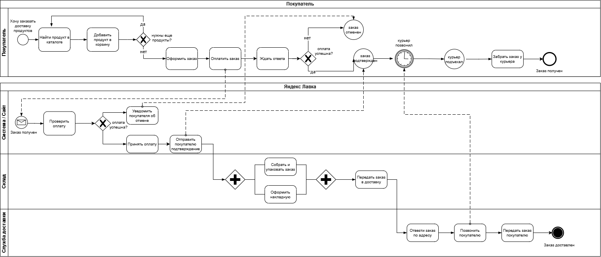
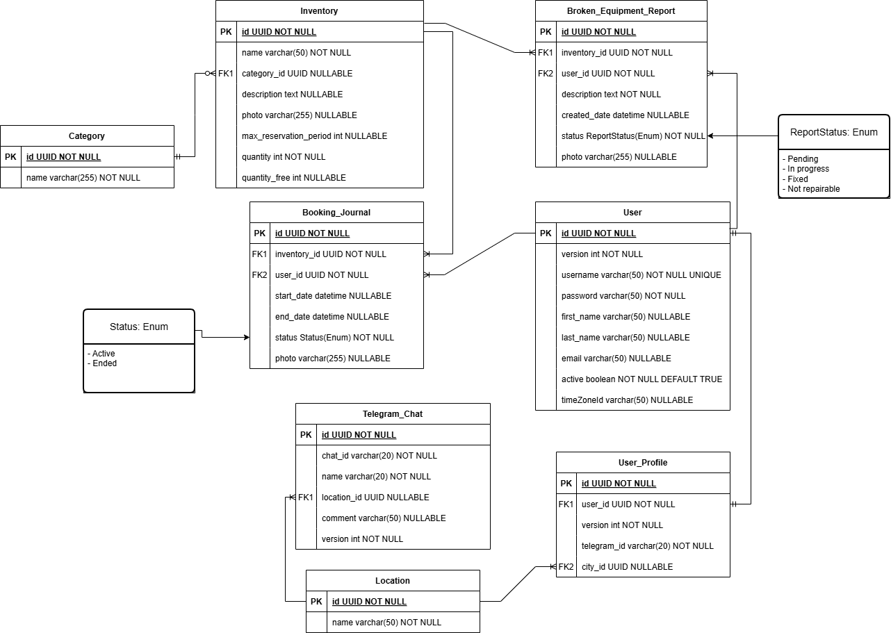
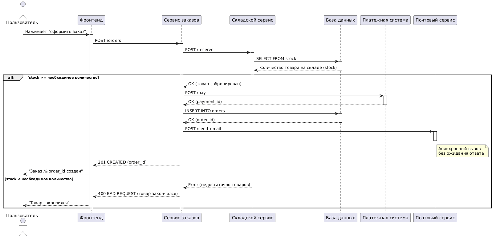
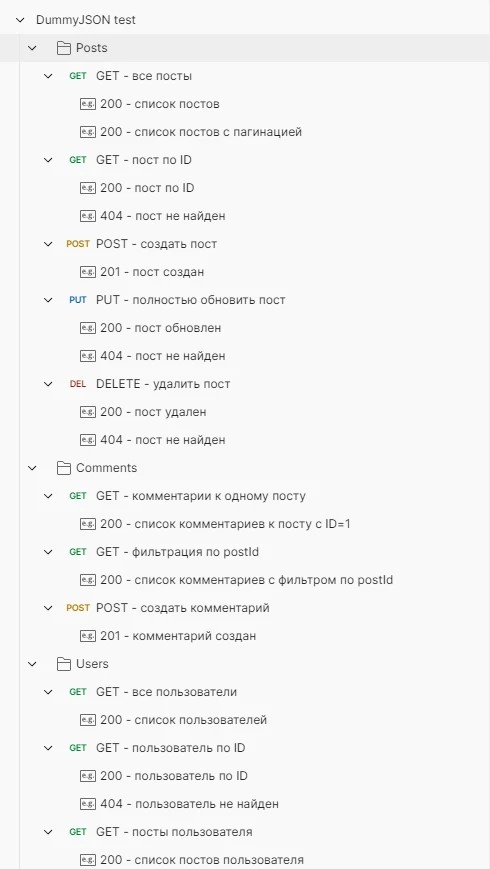
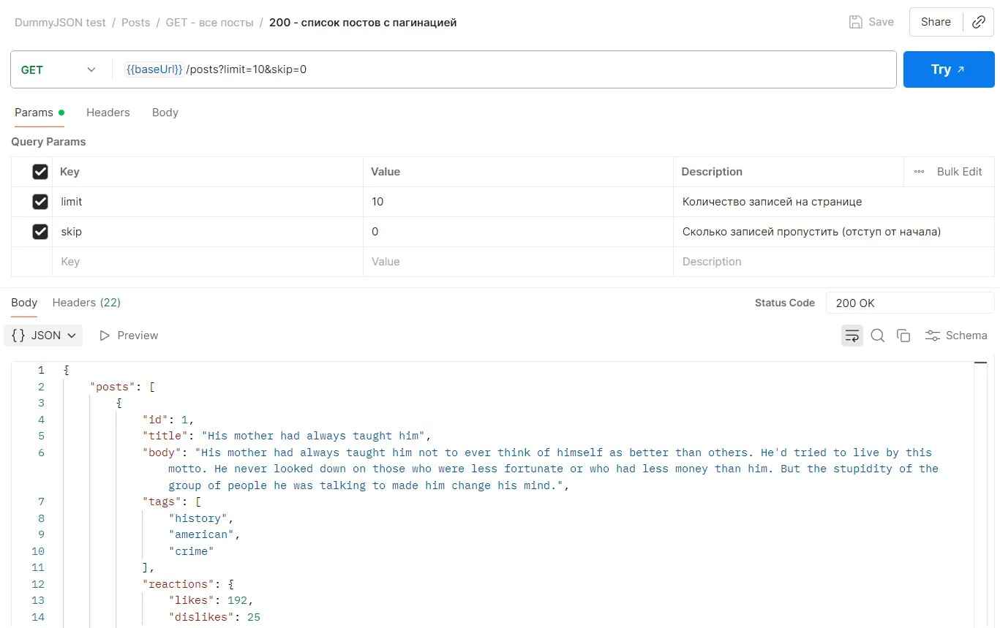

## 1. BPMN-диаграмма процесса заказа доставки продуктов

Описывает сценарий заказа доставки продуктов пользователем. Использовала нотацию BPMN 2.0.

## 2. ER-модель базы данных

Отображает основные сущности: `Inventory`, `User`, `Booking Journal` и другие и связи между ними (1-to-1, 1-to-many, many-to-many). Спроектирована в Drawio.

## 3. UML-диаграмма последовательностей

Показывает, как запрос на оформление заказа с фронта проходит путь через все компоненты системы. Код написан в PlantUML.

Файл с кодом: [`plantuml_оформление_заказа.puml`](plantuml_оформление_заказа.puml)

## 4. Коллекция запросов API в Postman

*Все основные запросы к тестовому API DummyJSON с описанием и сохраненными примерами успешных и неуспешных ответов.*

*Сохраненный пример успешного ответа на запрос GET /posts с пагинацией.*

Файл с коллекцией: [`srs_dynamic_tariff.docx`](srs_dynamic_tariff.docx)

**Инструменты:** Drawio, PlantUML, Postman
